# Практическая работа №8. Использование технологии Yandex DataLens для
анализа данных сетевой активности
kobyakmihail@yandex.ru

## Цель работы

1.  Изучить возможности технологии Yandex DataLens для визуального
    анализа структурированных наборов данных
2.  Получить навыки визуализации данных для последующего анализа с
    помощью сервисов Yandex Cloud
3.  Получить навыки создания решений мониторинга/SIEM на базе облачных
    продуктов и открытых программных решений
4.  Закрепить практические навыки использования SQL для анализа данных
    сетевой активности в сегментированной корпоративной сети

## Исходные данные

1.  Программное обеспечение Windows 11
2.  Интерпретатор языка R v4.5.1
3.  Rstudio IDE
4.  Yandex DataLens

## Общая ситуация

Для понимания сетевой обстановки и принятия решений по управлению
информационной безопасностью Вам необходимо визуально представить
результаты анализа информации, выполненной в YandexQuery с помощью
продукта DataLens. Конкретнее – serverless решение в облаке YandexCloud.
Как и прежде, у Вас есть данные сетевой активности в корпоративной сети
компании XYZ. Данные хранятся в Yandex Object Storage. Вы провели
разведочный анализ данных и имеете представление о структуре данных

Вам необходимо построить observability решение – средство визуального
представления информации для мониторинга и оценки сетевой активности.  

## Задание

Используя сервис Yandex DataLens настроить доступ к Yandex Query,
который Вы использовали в ходе ранее выполненных практических работ, и
визуально представить результаты анализа данных.

## Задачи

1.  Представить в виде круговой диаграммы соотношение внешнего и
    внутреннего сетевого трафика.
2.  Представить в виде столбчатой диаграммы соотношение входящего и
    исходящего трафика из внутреннего сетвого сегмента.
3.  Построить график активности (линейная диаграмма) объема трафика во
    времени.
4.  Все построенные графики вывести в виде единого дашборда в Yandex
    DataLens

## Шаги

### 1. Настроить подключение к Yandex Query из DataLens

Перейдем в соответствующий сервис – https://datalens.yandex.ru/:

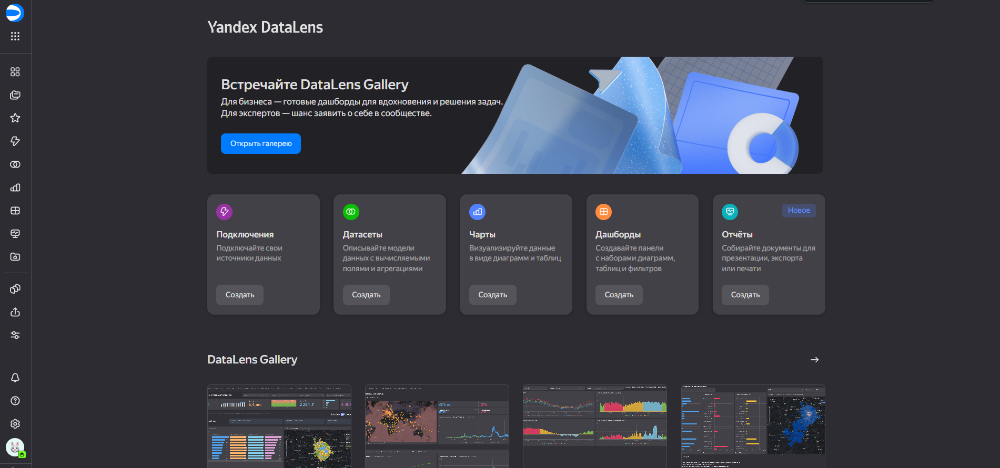

Создим новое подключение:

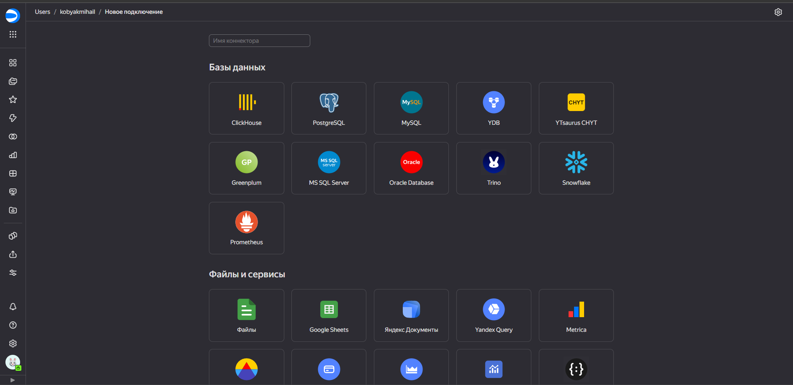

Выберем Yandex Query в блоке “Файлы и сервисы” и настроим подключение:

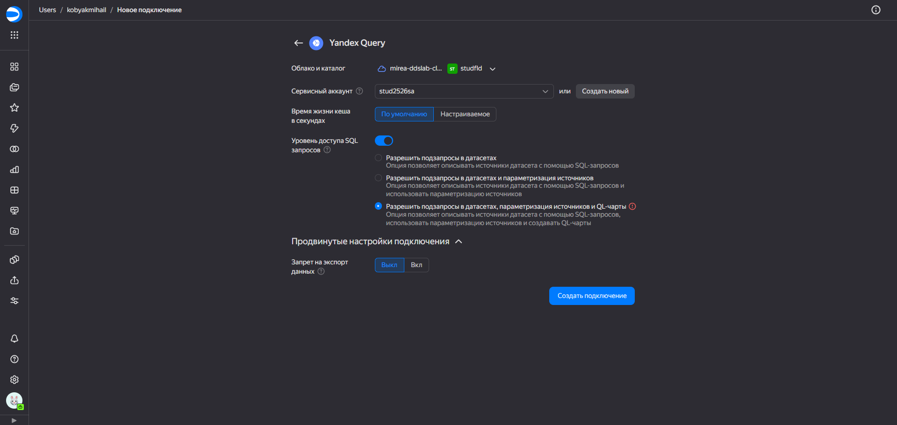

### 2. Создать из запроса YandexQuery датасет DataLens

Воспользуемся датасетом из предыдущей работы:

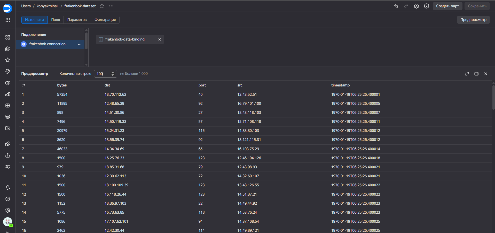

### 3. Делаем нужные графики и диаграммы

#### Создадим несколько новых чартов

Сначала создадим столбчатую диаграмму для подсчета количества обращений
по каждому порту. Предварительно создадим показатель `count_port`:

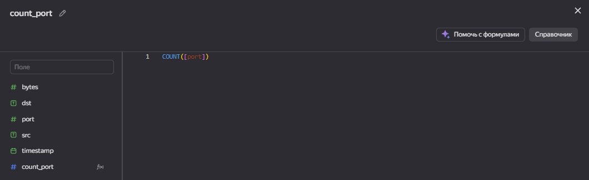

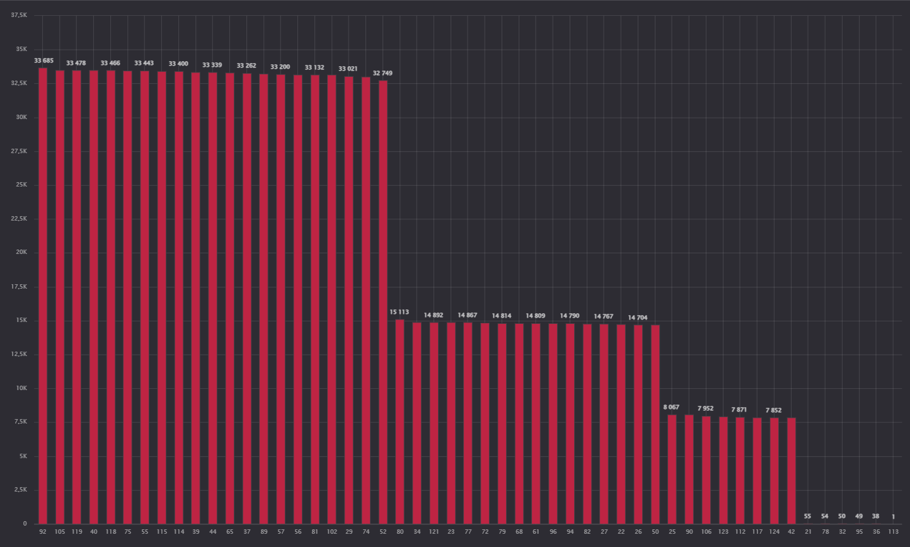

Создадим столбчатую диаграмму для подсчета среднего количества трафика
по каждому порту:

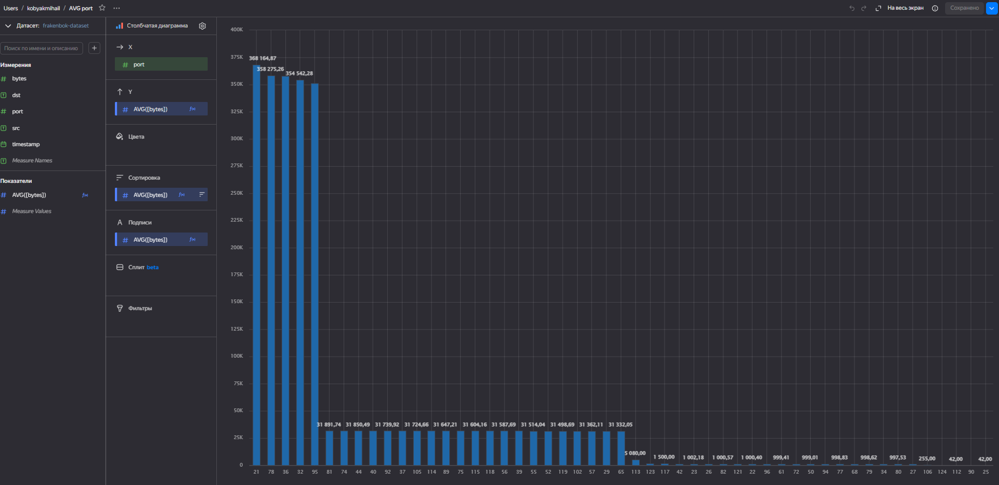

Создадим столбчатую диаграмму для подсчета максимального количества
трафика в одном пакете по каждому порту:

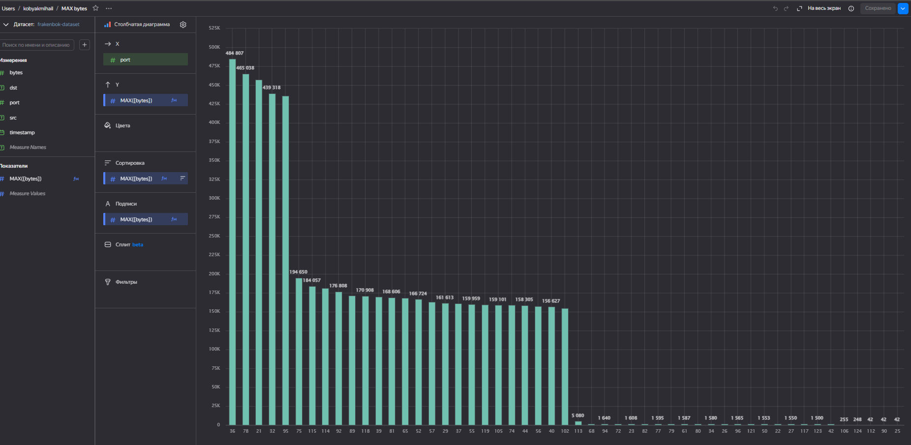

Сделаем график зависимости объема трафика по времени. Предварительно
создадим показатель `round_time`:

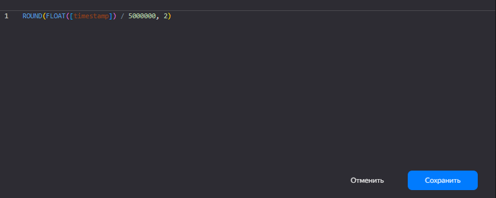

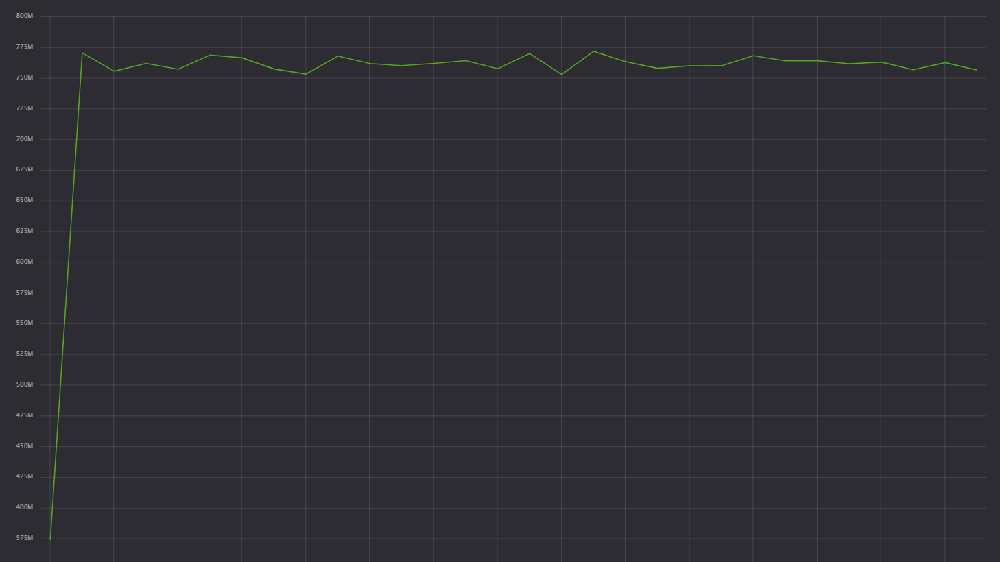

Сделаем круговую диаграмму для определения отношений входящего,
исходящего и внутреннего трафика. Предварительно создадим показатель
`traffic_type`, который будет классифицировать сетевые пакеты:

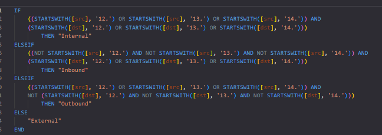

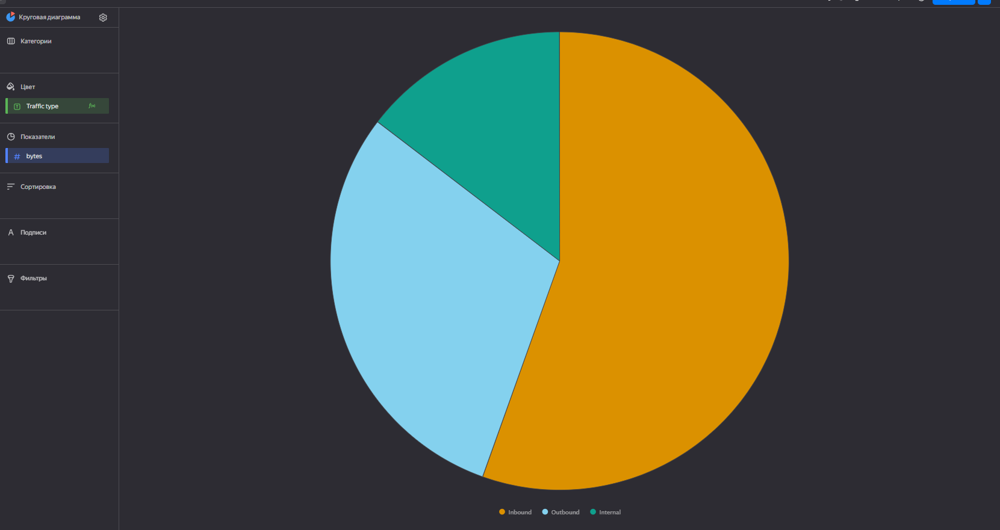

Соберем статистику о внутренних отправителях, которые отправляют
наибольшее каличество трафика. Для этого создадим поле `internal_src`
типа boolean и применим фильтр по нему. Показывать будем только
отправителей с трафиком больше 15 млн байтов:

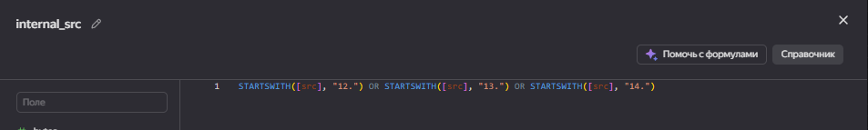

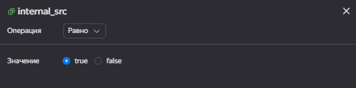

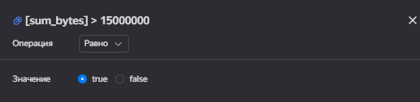

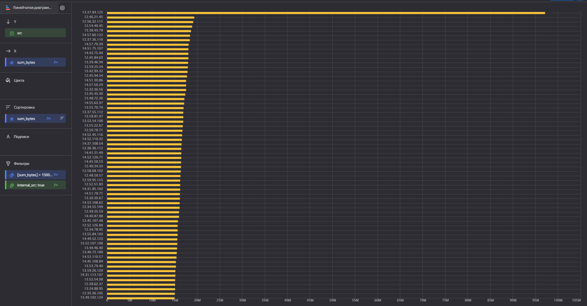

Соберем статистику о том, на какие внешние адреса отправляется
наибольшее количество трафика из внутренней сети. Для этого создадим
поля `internal_src` (как в предыдущем чарте) и `external_dst` типа
boolean, применим фильтры по ним. Показывать будем только отправителей с
трафиком больше 1.5 млн байтов:

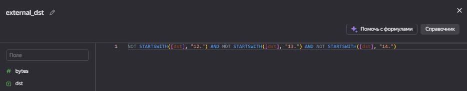

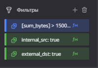

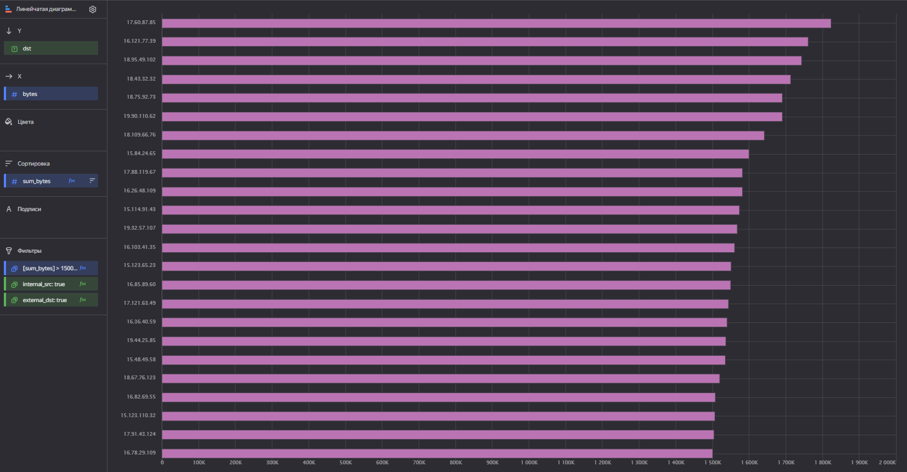

### 4. Составляем дашборд

Соберем все созданные чарты в один дашборд:

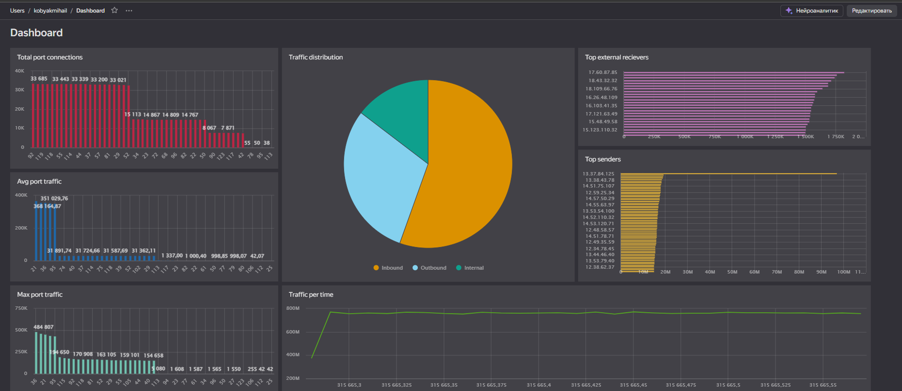

[Ссылка на мой дашборд](https://datalens.ru/rbqbble6fhzub-dashboard)

## Вывод

В данной работе мы научились строить визуализации с помощью сервиса
DataLens
